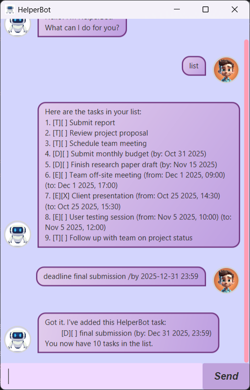

# HelperBot - Your Best Task Manager 🥇
> “Success is often achieved by those who don’t know that failure is inevitable.” – Coco Chanel ([source](https://dansilvestre.com/productivity-quotes))

<br>

HelperBot frees your mind from having to remember things you need to do. It's,

* text-based
* easy to learn
* ~~FAST~~ SUPER FAST to use



<br>

Have a view of <b>HelperBot<b> from [here](https://github.com/desmondwong1215/ip).

* Download it.
* Run the program on your computer.
* Add your tasks.
* Let it manage your tasks for you 😉
  And it is FREE!

<br>

## 🚀 Getting Started

### Prerequisites
- Java 17 or higher
- JavaFX SDK
- Gradle

### Installation

1. **Clone the repository**
```bash
git clone https://github.com/desmondwong1215/ip.git
cd ip
```

2. **Set up JavaFX**
    - Download JavaFX SDK from [OpenJFX website](https://openjfx.io/)
    - Add JavaFX to your module path

### Running Application
```
./gradlew run
```

<br>

## Features:
- [x] Add Task
- [x] Mark/ Unmark the Task
- [x] Get Task using Date
- [x] Get Task using Keyword
- [x] Delete Task
- [x] List Task
- [x] Update Task detail (including description, date, and time)

## How to use it?

### 1. Add a Task
We have three types of `Task`, which are `ToDo`, `Deadline`, and`Event`.

To add a `ToDo`:
```
todo [task name]
```

To add a `Deadline`:
```
deadline [task name] \by [date] [time]
```

To add an `Event`:
```
event [task name] \from [date] [time] \to [date] [time]
```
Noted that date should be in the format of `YYYY-MM-DD` and time (which is optional) should be in the format of `hh:mm`.

<br>

### 2. Check the Due Date of the `Task`
We can get a list of `Task`s that are due on the date specified.
```
check [date]
```
Noted that date should be in the format of `YYYY-MM-DD`.

<br>

### 3. Delete a `Task`
Delete a `Task` with its index; you can check its index using the `list` command.
```
delete [index]
```

<br>

### 4. Find a `Task`
List out all `Task`s with relevant description.
```
Find [description]
```

<br>

### 5. List all `Task`
```
list
```

<br>

### 6. Mark a `Task` as Done/ Not Done
Mark / Unmark a `Task` with its index; you can check its index using the `list` command.
```
mark [index]
```

```
unmark [index]
```

<br>

### 7. Update `Task`
To update a task, an user need the index and the type of the task. 
* Update description only.
    ```
    update [index] [new description]
    ```
* Update `Deadline`'s `byDate` and `byTime` only:
    ```
    update [index] \by [YYYY-MM-DD hh:mm]
    ```
* Update `Event`'s `fromDate` and `fromTime` only:
    ```
    update [index] \from [YYYY-MM-DD hh:mm]
    ```
* Update `Event`'s `toDate` and `toTime` only:
    ```
    update [index] \to [YYYY-MM-DD hh:mm]
    ```
* Update multiple fields
  * Eg. I want to update the description and DateTime of a deadline.
  ```
  update [index] [new description] \by [YYYY-MM-DD hh:mm]
  ```
  * Same logic apply for updating multiple fields in `Event`.

<br> 

### 8. Exit the program
User can close the program by tapping the close button on the top right or enter `bye` command.
```
bye
```

<br>

## Troubleshooting
If the user enters an invalid command, the HelperBot will output relevant error message to help user 
identify the problem.

<br>

Noted that all the commands are case-insensitive.
Eg.
```
todo [task name]
```
is the same as
```
TODO [task name]
```